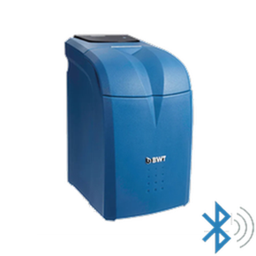

#  BWT AQA Perla BLE - Intégration Home Assistant

[](https://github.com/hacs/integration)
[](https://github.com/Micka41/bwt-aqa-perla-ble/releases)
[](https://github.com/Micka41/bwt-aqa-perla-ble)
[](https://github.com/Micka41/bwt-aqa-perla-ble/blob/main/LICENSE)
[](https://github.com/Micka41/bwt-aqa-perla-ble/issues)
[](https://github.com/Micka41/bwt-aqa-perla-ble/stargazers)
[](https://github.com/Micka41/bwt-aqa-perla-ble/actions/workflows/validate.yml)

> 🇬🇧 [English version available](README.md)

[](https://www.buymeacoffee.com/micka41 "Buy Me A Coffee") [](https://paypal.me/mpicaud41)

Intégration native Home Assistant pour l'adoucisseur d'eau **BWT AQA Perla** via Bluetooth Low Energy (BLE).

> Aucun broker MQTT requis. Fonctionne avec les proxys Bluetooth ESPHome.



---

## Fonctionnalités

- 🔵 **BLE natif** — utilise la pile Bluetooth de Home Assistant
- 📡 **Support proxy Bluetooth** — fonctionne avec les proxys ESPHome (pas besoin d'adaptateur USB BLE)
- 🔍 **Auto-découverte** — détecte automatiquement le BWT via son UUID de service BLE
- 📊 **18 entités** — niveau de sel, consommation d'eau, régénérations, coupures d'eau, autonomie sel, données de diagnostic
- 🌍 **Multilingue** — Français, Anglais, Allemand, Italien

## Capteurs

| Entité | Unité | Description |
|---|---|---|
| Niveau de sel | % | Pourcentage de sel restant |
| Sel restant | kg | Masse de sel restante |
| Capacité sel | kg | Capacité totale du bac à sel |
| Compteur d'eau | L | Consommation d'eau cumulée, jamais remise à zéro — à utiliser pour le tableau de bord Eau |
| Consommation aujourd'hui | L | Eau adoucie depuis minuit |
| Consommation hier | L | Eau adoucie la veille |
| Consommation 7 jours | L | Eau adoucie sur les 7 derniers jours |
| Régénérations aujourd'hui | régénérations | Cycles de régénération aujourd'hui |
| Coupures d'eau aujourd'hui | coupures | Interruptions d'alimentation en eau détectées aujourd'hui |
| Autonomie sel | jours | Estimation des jours de sel restants |
| Autonomie sel (semaines) | semaines | Estimation des semaines de sel restantes |
| Date fin autonomie | — | Date estimée d'épuisement du sel |
| Consommation moyenne 30 jours | L | Consommation quotidienne moyenne |
| Dernière synchronisation | — | Dernière synchronisation BLE réussie |
| Firmware | — | Version firmware de l'appareil |
| Heure de bascule journalière | — | Heure à laquelle l'adoucisseur commence une nouvelle journée dans son buffer journalier, apprise automatiquement (diagnostic) |
| Trames BROADCAST (debug) | — | Trames BROADCAST brutes (désactivée par défaut) |
| Alarme sel | — | « OK » ou « Alarme » |

## Entité de diagnostic

L'intégration inclut une **entité de diagnostic** (désactivée par défaut) qui capture les trames BROADCAST brutes pour le dépannage.

### Activation

1. Aller dans **Paramètres → Appareils et services → BWT AQA Perla BLE → [votre appareil]**
2. Activer l'entité **Trames BROADCAST (debug)**
3. Attendre le prochain cycle BLE (~1-2 minutes)

### Format de sortie

L'entité affiche les 10 dernières trames BROADCAST reçues avec horodatage :

```
2026-04-27 15:32:10 [20B]: 7c 36 02 00 ab 07 98 03 bc 07 34 00 12 02 15 54 00 00 00 00
2026-04-27 15:47:23 [20B]: 7c 36 02 00 ac 07 99 03 bc 07 34 00 12 02 15 54 00 00 00 00
...
```

### Cas d'usage

- **Débogage firmware** — si vous rencontrez des valeurs de sel inattendues (voir [Issue #4](https://github.com/Micka41/bwt-aqa-perla-ble/issues/4))
- **Support technique** — fournir des données brutes lors de rapports de bugs
- **Analyse de protocole** — comprendre la communication BLE du BWT

> **Note** : Cette entité est désactivée par défaut pour éviter une utilisation inutile des ressources. Ne l'activer que si nécessaire pour le diagnostic.

## Prérequis

- Home Assistant 2024.x ou plus récent
- Adoucisseur d'eau BWT AQA Perla
- Adaptateur Bluetooth **ou** au moins un [proxy Bluetooth ESPHome](https://esphome.io/components/bluetooth_proxy.html) à portée BLE de l'adoucisseur

> **Astuce :** Le signal BLE du BWT est faible (~-80 dBm à travers les murs). Placez le proxy ESP32 à 3-5 mètres de l'adoucisseur avec une ligne de vue directe pour de meilleurs résultats.

## Installation

### Via HACS (recommandé)

[](https://my.home-assistant.io/redirect/hacs_repository/?owner=Micka41&repository=bwt-aqa-perla-ble&category=integration)

Le bouton ci-dessus ouvre ce dépôt directement dans votre HACS. Cliquez ensuite
sur **Télécharger**, puis redémarrez Home Assistant.

<details>
<summary>Ajout manuel</summary>

1. Ouvrir HACS → **Intégrations**
2. Cliquer ⋮ → **Dépôts personnalisés**
3. Ajouter `https://github.com/Micka41/bwt-aqa-perla-ble` — Catégorie : **Integration**
4. Installer **BWT AQA Perla BLE**
5. Redémarrer Home Assistant

</details>

### Manuel

```bash
cp -r custom_components/bwt_aqa_perla_ble \
  /config/custom_components/bwt_aqa_perla_ble
```

Redémarrer Home Assistant.

## Configuration

### Auto-découverte (recommandé)

Home Assistant détectera automatiquement le BWT via son UUID de service BLE et affichera une notification dans **Paramètres → Intégrations** pour confirmer la configuration.

### Configuration manuelle

1. **Paramètres → Intégrations → Ajouter une intégration**
2. Rechercher **BWT AQA Perla BLE**
3. Entrer l'adresse MAC Bluetooth de votre appareil

## Proxy Bluetooth ESPHome

Pour étendre la portée BLE, flashez un ESP32 avec le [firmware proxy Bluetooth](https://esphome.io/components/bluetooth_proxy.html). Assurez-vous que `active: true` est défini :

```yaml
bluetooth_proxy:
  active: true
```

## Fonctionnement

L'adoucisseur tient deux historiques :

- un **buffer par quart d'heure** couvrant les 30 derniers jours, au litre près ;
- un **buffer journalier** couvrant jusqu'à 5 ans, en dizaines de litres.

L'intégration utilise un **double cycle de scrutation** :

- **Cycle rapide (toutes les 15 min) :** lit la caractéristique BROADCAST et les nouveaux quarts d'heure → ~5 s de connexion BLE
- **Cycle complet (toutes les heures) :** relit les quarts récents et les 365 derniers jours → ~20 s de connexion BLE. Le premier de chaque journée, dès 00 h 20, remonte 7 jours de quarts pour calculer hier et les 7 derniers jours.

Aujourd'hui, hier et les 7 derniers jours sont tous calculés à partir des quarts d'heure : journées calendaires de minuit à minuit, au litre près — les mêmes chiffres que l'application BWT.

### Compteur d'eau et tableau de bord Eau

*Compteur d'eau* est un compteur cumulé qui ne revient jamais à zéro. Il additionne chaque quart d'heure exactement une fois, et conserve sa valeur aux redémarrages de Home Assistant. Il part de 0 à l'installation de l'intégration ; les quarts d'heure écoulés pendant un arrêt de Home Assistant sont rattrapés ensuite, tant qu'ils ont moins de 30 jours.

C'est le capteur à utiliser dans **Paramètres → Tableaux de bord → Énergie → Consommation d'eau**. *Consommation aujourd'hui* est fait pour l'affichage : le quart d'heure de 23 h 45 à minuit est écrit par l'adoucisseur à minuit, après la dernière lecture de la journée, et n'apparaît donc jamais dans ce capteur.

### La journée de l'adoucisseur

Le buffer journalier ne commence **pas** ses journées à minuit. Chaque adoucisseur ouvre sa case journalière suivante à une heure qui lui est propre — vers 4 h sur un appareil, vers 9 h 30 sur un autre —, non documentée et sans rapport avec l'heure de régénération. L'intégration **l'apprend** en observant le moment où l'index journalier avance, sur les 7 dernières observations, et s'en sert pour dater correctement les cases journalières. Tant qu'aucune bascule n'a été observée (au plus 24 heures après l'installation), elle suppose un changement de case à minuit.

L'heure apprise est affichée par le capteur de diagnostic *Heure de bascule journalière* sur la page de l'appareil (par exemple `04:02`) ; il reste *Inconnu* tant qu'aucune bascule n'a été observée. Son attribut `observations` indique sur combien de bascules repose la valeur.

## Services / Actions

Trois services sont disponibles pour récupérer l'historique complet depuis l'appareil BWT. Les 29 derniers jours viennent du buffer par quart d'heure (au litre près, de minuit à minuit) ; les jours plus anciens, du buffer journalier. Chaque appel lit les deux buffers en entier, ce qui prend environ 1 minute à 1 minute 30 ; une lecture ratée est relancée automatiquement.

### `bwt_aqa_perla_ble.get_total_consumption`

Retourne la consommation totale d'eau en litres depuis la mise en service de l'appareil (jusqu'à 1825 jours), **jusqu'à hier inclus** — la consommation du jour est déjà fournie par le capteur *Consommation aujourd'hui*.

```json
{
  "total_liters": 125430,
  "days_count": 365,
  "from_date": "2024-04-07",
  "to_date": "2025-04-06",
  "day_rollover_learned": true
}
```

`day_rollover_learned` reste à `false` tant que l'intégration n'a pas observé le changement de case journalière de l'adoucisseur — au plus 24 heures après l'installation. D'ici là, le raccord entre cases journalières et quarts d'heure est placé à minuit par défaut, et le total peut être faux de quelques heures de consommation. Si une automatisation cumule ce total, vérifiez d'abord cet indicateur :

```jinja
 … 
```

### `bwt_aqa_perla_ble.get_history_consumption`

Retourne la consommation quotidienne d'eau (en litres) structurée par année/mois/jour.

```json
{
  "2024": {
    "04": { "07": 120, "08": 95, "09": 110 },
    "05": { "01": 130 }
  }
}
```

### `bwt_aqa_perla_ble.get_history_regenerations`

Retourne le nombre de cycles de régénération structuré par année/mois/jour.

```json
{
  "2024": {
    "04": { "07": 0, "08": 1, "09": 0 },
    "05": { "01": 0 }
  }
}
```

> Ces services peuvent être appelés depuis **Outils de développement → Services** dans Home Assistant ou depuis une automation.

## Compatibilité

Testé sur :
- BWT AQA Perla 10
- BWT Calypso 2
- BWT Blue 22l

Devrait fonctionner avec d'autres variantes BWT AQA Perla. Merci d'ouvrir une issue si vous avez un modèle différent et qu'il ne fonctionne pas.

## Contribuer

Les issues et pull requests sont les bienvenues. Merci d'inclure :
- Version de Home Assistant
- Logs de l'intégration (activer le niveau `debug` pour `custom_components.bwt_aqa_perla_ble`)
- Version firmware du BWT (visible dans le capteur Firmware)

## Licence

GNU General Public License v3.0 — voir [LICENSE](LICENSE)