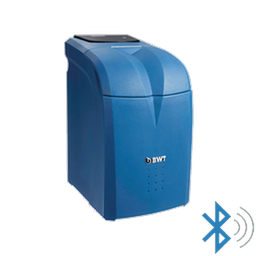

# BWT AQA Perla BLE — Intégration Home Assistant

[](https://github.com/hacs/integration)
[](https://github.com/Micka41/bwt-aqa-perla-ble/releases)
[](https://github.com/Micka41/bwt-aqa-perla-ble)
[](https://github.com/Micka41/bwt-aqa-perla-ble/blob/main/LICENSE)
[](https://github.com/Micka41/bwt-aqa-perla-ble/issues)
[](https://github.com/Micka41/bwt-aqa-perla-ble/stargazers)
[](https://github.com/Micka41/bwt-aqa-perla-ble/actions/workflows/validate.yml)

> 🇬🇧 [English version available](README.md)

[](https://www.buymeacoffee.com/micka41 "Buy Me A Coffee") [](https://paypal.me/mpicaud41)

Intégration native Home Assistant pour l'adoucisseur d'eau **BWT AQA Perla** via Bluetooth Low Energy (BLE).

> Aucun broker MQTT requis. Fonctionne avec les proxys Bluetooth ESPHome.



---

## Fonctionnalités

- 🔵 **BLE natif** — utilise la pile Bluetooth de Home Assistant
- 📡 **Support proxy Bluetooth** — fonctionne avec les proxys ESPHome (pas besoin d'adaptateur USB BLE)
- 🔍 **Auto-découverte** — détecte automatiquement le BWT via son UUID de service BLE
- 📊 **14 entités** — niveau de sel, consommation d'eau, régénérations, autonomie sel, données de diagnostic
- 🌍 **Multilingue** — Français, Anglais, Allemand, Italien

## Capteurs

| Entité | Unité | Description |
|---|---|---|
| Niveau de sel | % | Pourcentage de sel restant |
| Sel restant | kg | Masse de sel restante |
| Capacité sel | kg | Capacité totale du bac à sel |
| Consommation aujourd'hui | L | Eau adoucie depuis minuit |
| Consommation hier | L | Eau adoucie la veille |
| Consommation semaine | L | Eau adoucie sur les 7 derniers jours |
| Consommation moyenne (30 jours) | L | Consommation quotidienne moyenne |
| Régénérations aujourd'hui | — | Cycles de régénération aujourd'hui |
| Autonomie sel (jours) | jours | Estimation des jours de sel restants |
| Autonomie sel (semaines) | semaines | Estimation des semaines de sel restantes |
| Date fin autonomie | — | Date estimée d'épuisement du sel |
| Alarme sel | — | "OK" ou "Alarme" |
| Firmware | — | Version firmware de l'appareil |


## Entité de diagnostic

L'intégration inclut une **entité de diagnostic** (désactivée par défaut) qui capture les trames BROADCAST brutes pour le dépannage.

### Activation

1. Aller dans **Paramètres → Appareils et services → BWT AQA Perla BLE → [votre appareil]**
2. Activer l'entité **Trames BROADCAST (debug)**
3. Attendre le prochain cycle BLE (~1-2 minutes)

### Format de sortie

L'entité affiche les 10 dernières trames BROADCAST reçues avec horodatage :

```
2026-04-27 15:32:10 [20B]: 7c 36 02 00 ab 07 98 03 bc 07 34 00 12 02 15 54 00 00 00 00
2026-04-27 15:47:23 [20B]: 7c 36 02 00 ac 07 99 03 bc 07 34 00 12 02 15 54 00 00 00 00
...
```

### Cas d'usage

- **Débogage firmware** — si vous rencontrez des valeurs de sel inattendues (voir [Issue #4](https://github.com/Micka41/bwt-aqa-perla-ble/issues/4))
- **Support technique** — fournir des données brutes lors de rapports de bugs
- **Analyse de protocole** — comprendre la communication BLE du BWT

> **Note** : Cette entité est désactivée par défaut pour éviter une utilisation inutile des ressources. Ne l'activer que si nécessaire pour le diagnostic.

## Prérequis

- Home Assistant 2024.x ou plus récent
- Adoucisseur d'eau BWT AQA Perla
- Adaptateur Bluetooth **ou** au moins un [proxy Bluetooth ESPHome](https://esphome.io/components/bluetooth_proxy.html) à portée BLE de l'adoucisseur

> **Astuce :** Le signal BLE du BWT est faible (~-80 dBm à travers les murs). Placez le proxy ESP32 à 3-5 mètres de l'adoucisseur avec une ligne de vue directe pour de meilleurs résultats.

## Installation

### Via HACS (recommandé)

1. Ouvrir HACS → **Intégrations**
2. Cliquer ⋮ → **Dépôts personnalisés**
3. Ajouter `https://github.com/Micka41/bwt-aqa-perla-ble` — Catégorie : **Integration**
4. Installer **BWT AQA Perla BLE**
5. Redémarrer Home Assistant

### Manuel

```bash
cp -r custom_components/bwt_aqa_perla_ble \
  /config/custom_components/bwt_aqa_perla_ble
```

Redémarrer Home Assistant.

## Configuration

### Auto-découverte (recommandé)

Home Assistant détectera automatiquement le BWT via son UUID de service BLE et affichera une notification dans **Paramètres → Intégrations** pour confirmer la configuration.

### Configuration manuelle

1. **Paramètres → Intégrations → Ajouter une intégration**
2. Rechercher **BWT AQA Perla BLE**
3. Entrer l'adresse MAC Bluetooth de votre appareil

## Proxy Bluetooth ESPHome

Pour étendre la portée BLE, flashez un ESP32 avec le [firmware proxy Bluetooth](https://esphome.io/components/bluetooth_proxy.html). Assurez-vous que `active: true` est défini :

```yaml
bluetooth_proxy:
  active: true
```

## Fonctionnement

L'intégration utilise un **cycle de scrutation double** :

- **Cycle rapide (toutes les 15 min) :** lit la caractéristique BROADCAST + entrées récentes par quart d'heure → ~5s de connexion BLE
- **Cycle complet (toutes les heures, forcé à 04h00) :** lit l'historique complet (quarts + journalier) → ~20s de connexion BLE

La consommation journalière est calculée comme un accumulateur (`base` du cycle complet + `delta` du cycle rapide) pour s'assurer qu'elle n'augmente que pendant la journée et se réinitialise à minuit.

La consommation d'hier n'est mise à jour qu'une fois que le BWT a consolidé le jour précédent (~04h00) pour éviter d'afficher 0 pendant la nuit.

## Services / Actions

Trois services sont disponibles pour récupérer l'historique complet depuis l'appareil BWT. Chaque service déclenche une connexion BLE complète (~30-60 secondes).

### `bwt_aqa_perla_ble.get_total_consumption`

Retourne la consommation totale d'eau en litres depuis la mise en service de l'appareil (jusqu'à 1825 jours).

```json
{
  "total_liters": 125430,
  "days_count": 365,
  "from_date": "2024-04-07",
  "to_date": "2025-04-06"
}
```

### `bwt_aqa_perla_ble.get_history_consumption`

Retourne la consommation quotidienne d'eau (en litres) structurée par année/mois/jour.

```json
{
  "2024": {
    "04": { "07": 120, "08": 95, "09": 110 },
    "05": { "01": 130 }
  }
}
```

### `bwt_aqa_perla_ble.get_history_regenerations`

Retourne le nombre de cycles de régénération structuré par année/mois/jour.

```json
{
  "2024": {
    "04": { "07": 0, "08": 1, "09": 0 },
    "05": { "01": 0 }
  }
}
```

> Ces services peuvent être appelés depuis **Outils de développement → Services** dans Home Assistant ou depuis une automation.

## Compatibilité

Testé sur :
- BWT AQA Perla 10
- BWT Calypso 2

Devrait fonctionner avec d'autres variantes BWT AQA Perla. Merci d'ouvrir une issue si vous avez un modèle différent et qu'il ne fonctionne pas.

## Contribuer

Les issues et pull requests sont les bienvenues. Merci d'inclure :
- Version de Home Assistant
- Logs de l'intégration (activer le niveau `debug` pour `custom_components.bwt_aqa_perla_ble`)
- Version firmware du BWT (visible dans le capteur Firmware)

## Licence

GNU General Public License v3.0 — voir [LICENSE](LICENSE)