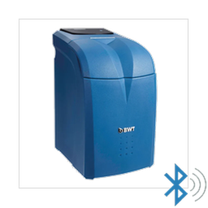

# BWT AQA Perla BLE — Home Assistant Integration

<a href="https://www.buymeacoffee.com/micka41" target="_blank"></a>

[](https://github.com/hacs/integration)
[](https://github.com/Micka41/bwt-aqa-perla-ble/releases)


Native Home Assistant integration for the **BWT AQA Perla** water softener via Bluetooth Low Energy (BLE).

> No MQTT broker required. Works with ESPHome Bluetooth proxies.



---

## Features

- 🔵 **Native BLE** — uses Home Assistant's Bluetooth stack
- 📡 **Bluetooth proxy support** — works with ESPHome proxies (no USB BLE adapter needed)
- 🔍 **Auto-discovery** — detects the BWT automatically via BLE service UUID
- 📊 **11 sensors** — salt level, water consumption, regenerations, salt autonomy
- 🌍 **Multilingual** — French, English, German

## Sensors

| Entity | Unit | Description |
|---|---|---|
| Salt level | % | Remaining salt percentage |
| Salt remaining | kg | Remaining salt mass |
| Salt capacity | kg | Total brine tank capacity |
| Consumption today | L | Water softened since midnight |
| Consumption yesterday | L | Water softened the previous day |
| Consumption week | L | Water softened over the last 7 days |
| Regenerations today | — | Regeneration cycles today |
| Regenerations yesterday | — | Regeneration cycles yesterday |
| Salt autonomy (days) | days | Estimated days of salt remaining |
| Salt autonomy (weeks) | weeks | Estimated weeks of salt remaining |
| Salt alarm | — | "OK" or "Alarm" |
| Firmware | — | Device firmware version |

## Requirements

- Home Assistant 2024.x or newer
- BWT AQA Perla water softener
- Bluetooth adapter **or** at least one [ESPHome Bluetooth proxy](https://esphome.io/components/bluetooth_proxy.html) within BLE range of the softener

> **Tip:** The BWT BLE signal is weak (~-80 dBm through walls). Place the ESP32 proxy within 3–5 meters of the softener with line of sight for best results.

## Installation

### Via HACS (recommended)

1. Open HACS → **Integrations**
2. Click ⋮ → **Custom repositories**
3. Add `https://github.com/Micka41/bwt-aqa-perla-ble` — Category: **Integration**
4. Install **BWT AQA Perla BLE**
5. Restart Home Assistant

### Manual

```bash
cp -r custom_components/bwt_aqa_perla_ble \
  /config/custom_components/bwt_aqa_perla_ble
```

Restart Home Assistant.

## Configuration

### Auto-discovery (recommended)

Home Assistant will automatically detect the BWT via its BLE service UUID and show a notification in **Settings → Integrations** to confirm the setup.

### Manual setup

1. **Settings → Integrations → Add integration**
2. Search for **BWT AQA Perla BLE**
3. Enter the Bluetooth MAC address of your device

## ESPHome Bluetooth Proxy

To extend BLE range, flash an ESP32 with the [Bluetooth proxy firmware](https://esphome.io/components/bluetooth_proxy.html). Make sure `active: true` is set:

```yaml
bluetooth_proxy:
  active: true
```

## How it works

The integration uses a **dual polling cycle**:

- **Fast cycle (every 15 min):** reads BROADCAST characteristic + recent quarter-hour entries → ~5s BLE connection
- **Full cycle (every 1h, forced at 04:00):** reads full history (quarters + daily) → ~20s BLE connection

Daily consumption is computed as an accumulator (`base` from full cycle + `delta` from fast cycle) to ensure it only increases during the day and resets at midnight.

Yesterday's consumption is only updated once the BWT has consolidated the previous day (~04:00 AM) to avoid showing 0 during the night.

## Compatibility

Tested on:
- BWT AQA Perla Silk (A22X firmware)

Should work with other BWT AQA Perla variants. Please open an issue if you have a different model and it doesn't work.

## Contributing

Issues and pull requests are welcome. Please include:
- Home Assistant version
- Integration logs (enable `debug` level for `custom_components.bwt_aqa_perla_ble`)
- BWT firmware version (visible in the Firmware sensor)

## License

GNU General Public License v3.0 — see [LICENSE](LICENSE)
